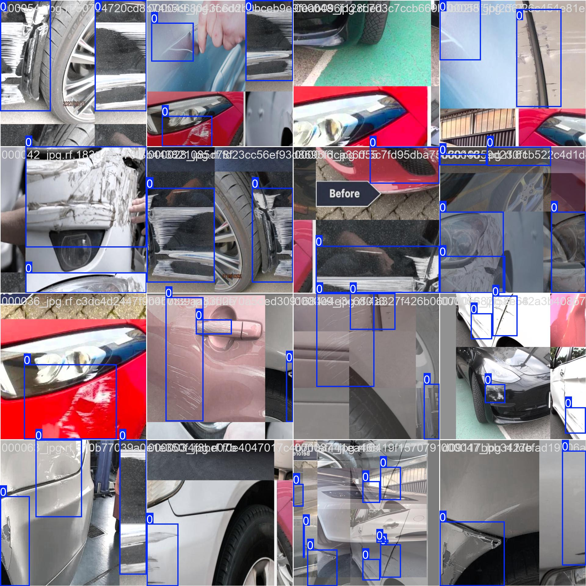
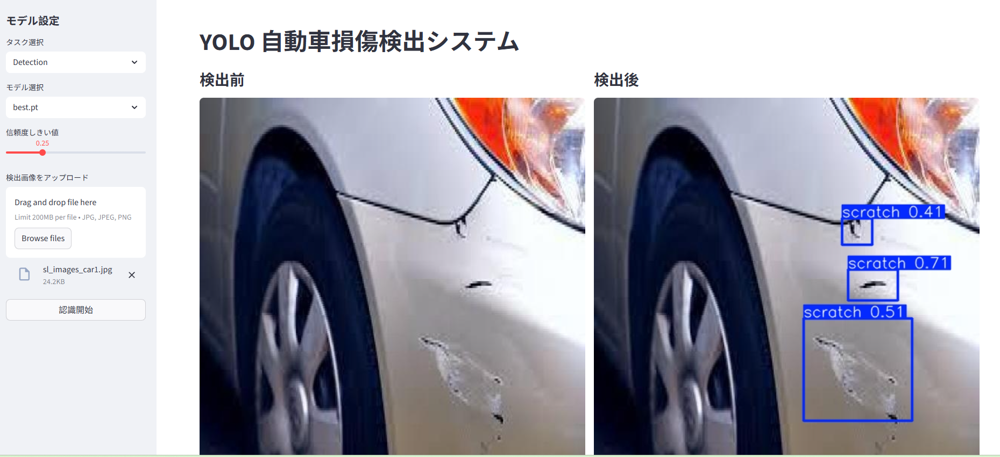

# 自動車損傷検出自動化システム (CAR SCRATCH DETECTION)

本プロジェクトは YOLO26 をベースに、YOLO 形式データセットで学習した「自動車損傷検出」モデルです。
Streamlit で `app.py` を起動して Web UI で利用できるほか、`train_yolo26.py` を使って `dataset/` に自分のデータを追加し再学習することも可能です。
現時点では自動車外観の傷（スクラッチ）検出が主用途ですが、将来的には「車体や部品の損傷チェック」「リース車両や自動車の状態評価」「事故車の損傷調査」などにも応用可能です。

<p align="center">
  
</p>

## 依存関係のインストール

```powershell
python -m pip install -r requirements.txt
```

CUDA 版 PyTorch を利用する場合は、GPU/CUDA バージョンに対応した公式ホイールをインストールしてください。

## UI 交互界面

Streamlit で UI を起動します。起動後、ターミナルに表示される URL（通常 `http://localhost:8501`）へブラウザでアクセスします。

```powershell
streamlit run app.py
```

### 画面の機能と使い方

- サイドバー
  - 「モデル設定」
  - 「タスク選択」: 現在は Detection のみ
  - 「モデル選択」: ルート直下の `.pt` を自動検出（例: `best.pt`）
  - 「信頼度しきい値」: 0.0〜1.0 をスライダーで指定
  - 「検出画像をアップロード」: jpg/jpeg/png
  - 「認識開始」: クリック後に推論開始
- メイン画面
  - 左: 検出前の画像
  - 右: 検出後の画像（バウンディングボックス描画）
  - 検出数と信頼度をテーブル表示
  - 検出がない場合はメッセージ表示

<p align="center">
  
</p>

## 訓練使用順序

1. データ配置
   - `dataset/images/train|val|test`
   - `dataset/labels/train|val|test`

2. データチェックと `dataset.yaml` 生成

```powershell
python scripts/prepare_dataset.py
```

3. 学習開始（デフォルトで `best.pt` を初期重みとして使用）

```powershell
python scripts/train_yolo26.py
```

必要に応じてパラメータを上書きできます。

```powershell
python scripts/train_yolo26.py --model best.pt --imgsz 960 --batch 8 --epochs 200
```

### 学習結果の確認

- 学習ログと重みは `runs/train/<実験名>/` に保存されます。
- 代表的な出力: `weights/best.pt`, `weights/last.pt`

### 学習後の推論コマンド例

テスト画像に対して推論し、結果画像を保存します。

```powershell
yolo predict model=best.pt source=dataset/images/test conf=0.25 save=True project=runs/predict name=car-scratch-test
```

## 補足

- すべてのスクリプトは Python 3.10 標準ライブラリのみを直接利用しています（外部実行は `yolo` CLI）。
- `yolo` コマンド名が異なる場合は `--yolo-cmd` で指定してください。

